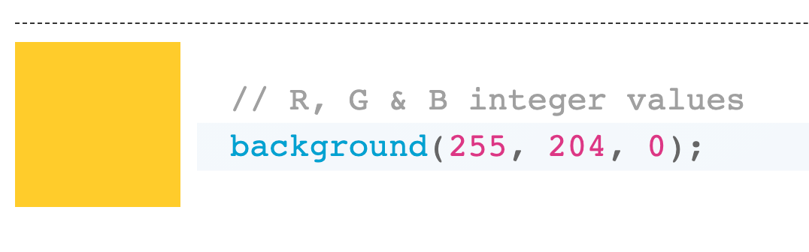
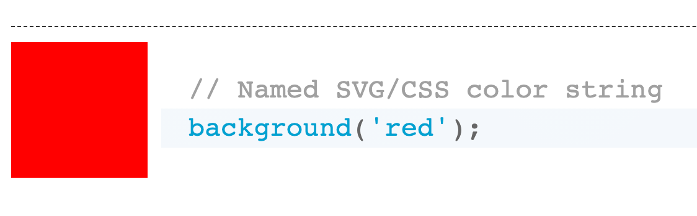

# CreateCanvas and Background

Before reading about **createCanvas** and **background** it is beneficial for you to first explore and manipulate the information on your Sketch.  Change the numbers inside the parenthesis (), for both the **createCanvas** and **background** functions, and each time you make a change, run the code and try to define what each number controls. &#x20;

### CreateCanvas


```javascript
//  Update the createCanvas function as below
createCanvas(800,400);
```


The createCanvas function sets the size of the application we are making.  The first number determines the width (x) and the second the height (y) of the canvas.


[Click here for a deeper dive on **createCanvas**](https://p5js.org/reference/#/p5/createCanvas)


### background


```javascript
background(220);
```


The background function changes the colour of the canvas.  The colour can be expressed using several different methods, such as RGB, Hexadecimal, HTML text, and more.  We will work with RGB, where the function expects three numbers ranging from 0 to 255.&#x20;

The three numbers represent how much of each colour is in the final mix

* The first number represents the amount of red
* The second number represents the amount of green
* The third number represents the amount of blue


```javascript
// Racetrack with colour (using RGB)
background(200,255,200);
```


### Examples

<figure><figcaption><p>RGBexample</p></figcaption></figure>


To find the right numbers to get a colour in RGB, you can use this [colour picker](https://www.google.com/search?q=colour+picker\&oq=colour+pick\&aqs=chrome.0.69i59i512j69i57j0i512l8.2660j0j7\&sourceid=chrome\&ie=UTF-8).

For additional colour names to try, see [this site.](https://www.w3schools.com/cssref/css\_colors.asp)


<figure><figcaption><p>SVG/CSS colour string</p></figcaption></figure>

<details>

<summary><span data-gb-custom-inline data-tag="emoji" data-code="1f34e">🍎</span>Teacher's Corner  - RGB Colours</summary>

"RGB refers to three hues of light that can be mixed together to create different colours"&#x20;

</details>

<details>

<summary>🍎 Teacher's Corner - Comments in Code</summary>

Using comments in code can help better understand what each line of code executes and help communicate from one coder to another.   In JavaScript we write comments by placing two slashes // before the text we want to comment out or multi-line comments by wrapping the text with /\* \*/

```javascript
// this is a single line comment in JavaScript

/*
this is a multi-line comment in JavaScript
this is a multi-line comment in JavaScript
*/
```

</details>
