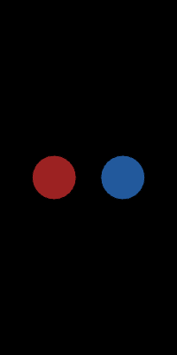

# Group Work During Class

### Matrix Poster Recreation

<figure><figcaption></figcaption></figure>

### Code

```javascript
let circleDiameter = 50;
let circleXPosition = 50;
let redCircleX = 150;

function setup() {
  createCanvas(200, 400);
}

function draw() {
  background('black');

  fill(156, 34, 34);
  circle(circleXPosition, 200, circleDiameter);
  
  circleXPosition = circleXPosition + 0.2;
  
  fill(34, 89, 156);
  circle(redCircleX, 200, circleDiameter);
  
  redCircleX = redCircleX - 0.2;
}
```

### Link to the project in p5

[https://editor.p5js.org/Garcila/sketches/QEXaBOenC](https://editor.p5js.org/Garcila/sketches/QEXaBOenC)

